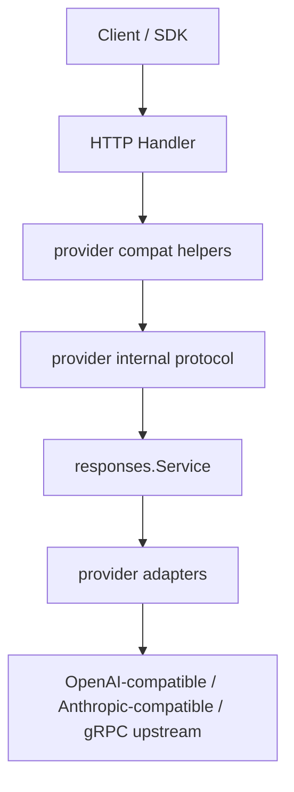

# Provider Protocol

更新时间：2026-04-21

本文档描述 Gateyes 当前采用的协议边界：不再保留单独的 `apicompat` 包，统一由 `internal/service/provider` 同时承担：

1. 内部统一 request / response / event 协议
2. OpenAI-compatible 请求转内部协议
3. Anthropic-compatible 请求转内部协议
4. 内部协议转 OpenAI / Anthropic 兼容响应
5. OpenAI / Anthropic 兼容 SSE 编码
6. 上游 provider-native request / response / stream 适配
7. provider registry capability / health / drain metadata

## 设计原则

### 1. 单一内部协议

内部统一协议只保留一份，定义在 `internal/service/provider/types.go`：

- `ContentBlock`
- `Message`
- `ToolCall`
- `ResponseRequest`
- `Response`
- `ResponseEvent`
- `Usage`

`responses.Service`、`router`、`middleware`、`handler` 都围绕这套协议协作，不再维护第二份 canonical model。

### 2. 外部兼容层属于 `provider`

OpenAI / Anthropic 的外部兼容 DTO 和转换逻辑仍然需要，但不再单独拆包，而是收在 `provider` 单包内：

- `internal/service/provider/compat_openai.go`
- `internal/service/provider/compat_openai_stream.go`
- `internal/service/provider/compat_anthropic.go`
- `internal/service/provider/compat_anthropic_stream.go`

这样做的原因是：

- 这些逻辑和 provider 内部统一协议是强耦合的
- handler 只需要调用 helper，不需要再经过额外抽象层
- 避免 `provider` 与 `apicompat` 同时维护两份协议真相

### 3. handler 只做 HTTP，不做协议语义判断

当前 handler 三类入口分别是：

- `/v1/responses`
  - 直接绑定 `provider.ResponseRequest`
- `/v1/chat/completions`
  - 绑定 `provider.ChatCompletionRequest`
  - 调用 `provider.ConvertChatRequest(...)`
- `/v1/messages`
  - 绑定 `provider.AnthropicMessagesRequest`
  - 调用 `provider.ConvertAnthropicRequest(...)`

返回路径同理：

- chat 返回 `provider.ConvertResponseToChat(...)`
- anthropic 返回 `provider.ConvertResponseToAnthropic(...)`
- 流式分别使用：
  - `provider.NewChatStreamEncoder(...)`
  - `provider.NewAnthropicStreamEncoder(...)`

## 当前文件边界

### `types.go`

负责内部统一协议和公共 helper：

- canonical request / response / event types
- normalization helpers
- clone helpers
- token estimation helpers

### `compat_openai.go`

负责 OpenAI-compatible 非流式兼容层：

- Chat DTO
- request -> internal convert
- internal response -> Chat response convert
- stateless Chat chunk helper

### `compat_openai_stream.go`

负责 OpenAI-compatible stateful stream encoder：

- duplicate finish suppression
- assistant role 注入
- tool call stream chunk 合成

### `compat_anthropic.go`

负责 Anthropic-compatible 非流式兼容层：

- Messages DTO
- request -> internal convert
- internal response -> Messages response convert

### `compat_anthropic_stream.go`

负责 Anthropic-compatible stateful stream encoder：

- message_start / message_delta / message_stop
- text / thinking / tool_use block 生命周期

### `openai_*` 与 `anthropic_*`

负责上游 provider adapter：

- request build
- response parse
- stream parse
- vendor-specific behavior

### `grpc_*`

负责 gRPC-native provider adapter：

- gRPC 请求 build
- `Generate` / `GetTokenizer` 调用
- tokenizer archive 拉取和本地 decode
- stream token ids -> text delta 转换
- gRPC status -> canonical upstream error 映射

### provider registry metadata

当前 provider 层还额外承担一层轻量 control-plane metadata：

- config 启动时 seed 到 `provider_registry`
- metadata 字段包含：
  - enabled
  - drain
  - health_status
  - routing_weight
  - supports_chat / responses / messages
  - supports_stream / tools / images / structured_output / long_context
- `responses.Service` 在进入 router 前先根据 registry 做过滤
- `AdminHandler` 可以读取和更新这层 metadata

### grpc-vllm 当前边界

当前 `type=grpc` + `vendor=vllm` adapter 的能力边界是：

- 走 `responses` 主链路
- 支持非流式文本输出
- 支持流式文本输出
- 支持 `json_schema` / structured output 请求透传到 vLLM sampling params
- 通过 `GetTokenizer` 拉取真实 tokenizer archive，并在 Gateyes 本地 decode token ids
- 当前不支持 request-level tools
- 当前不支持 image input

之所以要额外拉 tokenizer，是因为 vLLM gRPC `Generate` 返回的是 token ids / output ids，不是现成文本块。Gateyes 必须先完成 decode，才能继续复用自己的 canonical `ResponseEvent` 文本流。

## 请求链路

## 为什么不用独立 `apicompat`

当前代码实践里，单独的 `apicompat` 包没有带来足够收益，反而产生了几个问题：

1. `provider` 和 `apicompat` 很容易各自维护一份 DTO / convert
2. handler 需要跨两个协议层跳转
3. 重构时容易出现“内部协议一份、外部兼容一份、provider 自己又有一份”的漂移

因此当前选择是：

- 包边界简化
- 文件边界清晰
- 内部协议唯一

## 已删除的旧设计

- `internal/protocol/apicompat`
  - 已删除
- `internal/service/streaming`
  - 已删除，原先是未接入主链路的旧 raw proxy 流式实现

## 未来演进边界

如果后续继续演进，建议遵守这三条规则：

1. 不再新增第二套内部 canonical model
2. 新 provider 直接围绕 `provider.ResponseRequest / Response / ResponseEvent` 实现
3. 新外部兼容 surface 若真的出现，也优先先评估是否仍可收敛在 `provider` 单包内，而不是默认再拆一个协议包
